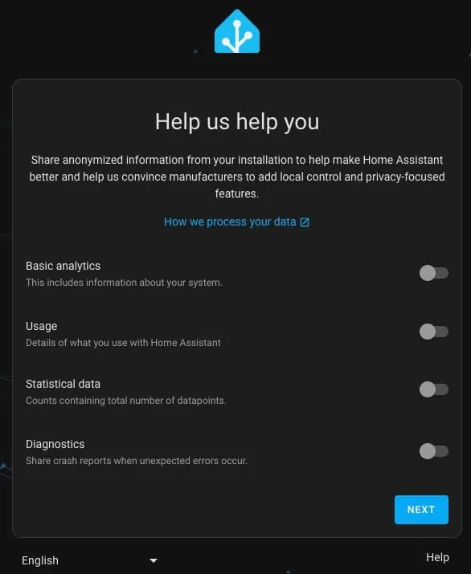

# Installing Home Assistant OS (HAOS) VM

1. Login to Proxmox and select your server in the left pane.
2. Click on **Shell** in the middle pane.
3. Enter the following command to start the HAOS install via the Proxmox script.
**Note:** We will be using the advanced settings to optimize the configuration. The script automatically downloads the latest HAOS stable image, creates the Proxmox VM, and will configure the hardware and networking.

```console
bash -c "$(wget -qLO - https://github.com/ryanwclark1/homelab/homeassistant/raw/main/vm/haos-vm.sh)"
```

4. Press Enter to proceed.

5. Select Advanced (NOT Yes).

6. For the version chose latest stable version. HAOS is regularly updated, so the screenshot may not reflect what you see.

7. Leave the default Virtual Machine ID.
8. Leave the default Machine Type.
9. Verify Write Through Disk Cache is selected.

**Explanation**: If you use “none” then the HAOS filesystem or database(s) within HAOS can be corrupted during unexpected power loss to your server. Write through causes an fsync for each write. It’s the more secure cache mode, as you can’t lose data but it is also slower. In fact, Proxmox documentation gives you a warning for “None” (which is the Default): **Warning: like writeback, you can lose data in case of a power failure.**


12. Chose your **Core Count** (2 is fine).
13. Chose your **RAM** (I’d recommend 4-6GB).
14. Leave the **Bridge**.
15. Leave the **MAC Address**.
16. Leave the **VLAN**.
17. Leave the **MTU Size**.
18. Select **Yes** to start VM after creation.
20. If prompted to select the storage use the **space bar** to select the desired disk then tab to Ok.

**Note**: It is **STRONGLY** urge you to use local Proxmox storage (e.g., local-lvm), not storage backed by a NAS. If there’s a network hiccup or the NAS goes offline you could easily end up with a corrupted VM.

21. Wait for the installer to complete. This will take a few minutes.
22. Once the VM is created, click on it in the left pane and then select console in the middle pane. Note the IP address and port number (8123).


23. Open a browser and open a HTTP connection (http://IP:8123).
24. Depending on the speed of your server, you may see a Preparing Home Assistant screen for several minutes. Wait until you see Welcome!.
25. Click on Create my smart home.


26. On the Create User screen enter your name, username and password. Click Create Account.
27. On the Home Location screen enter your home address. The map should now show your home neighborhood. Click Next.
28. Select what, if any, analytics you went to send back to the Home Assistant mother ship. Click Next.

29. On the next screen HA will show you all of the devices and services that it found on your network. Click Finish.


### Setting Static IP Address (Recommended)

It is would strongly recommend that HAOS be configured to use a static IPv4 address. You can do this by either a DHCP reservation in your router, or set a static IP in the Home Assistant user interface. I would leave IPv6 set to Automatic.

In the left pane click on Settings -> System -> Network. Click on IPv4.
Change to Static and enter the details. Click Save.
Change the address you are connecting to in your bowser and verify HA is using the new IP.

### Blocked DNS over HTTPS Workaround

If you are blocking **OUTBOUND** DNS over HTTPS, then you might run into a HA bug where HA floods your firewall with TENS OF MILLIONS of DNS queries indefinitely. In order to work around this bug, we will install the SSH add-on and then modify the HA DNS configuration.

1. Click on your name in the lower left panel.
2. In the right pane enable Advanced Mode.
3. Click on Settings in the left pane, then Add-ons.
4. Click on Add-on store in the lower right
5. Search for “ssh” and select the Advanced SSH & Web Terminal. Click on it.
6. Click Install.
7. After it installs, click on Show in sidebar.
8. Click on Configuration at the top of the screen.
9. Enter the username and password that you configured on the initial HA setup screen. Click on Save.

10. Click on the Info tab at the top left of the screen.
11. Click on Start.
12. In the left pane in HA click on Terminal.
13. Run the following two commands:
```console
ha dns options --fallback=false
ha dns restart
```
14. Re-enable the DoH block rule on your firewall.
15. Monitor your network to verify your firewall is not being flooded with DNS requests.

### USB Passthrough to HAOS (Optional)
If you have any USB dongles for radios such as z-wave, Zigbee, Thread, etc, we need to pass it through to the HAOS VM. This is optional, and not needed if you have no USB devices to passthrough. I am using the [Home Assistant Connect ZBT-1](https://www.home-assistant.io/connectzbt1/) Zigbee/Thread/Matter USB dongle.

1. Connect your USB dongle to your server.
2. In the left pane click on your HAOS VM.
3. In the middle pane click Hardware.
4. Click on Add then USB Device.
5. Select Use USB Vendor/Device ID.
6. Chose the USB device to passthrough.

7. In the upper right hand corner of the VM pane click on the down arrow next to Shutdown and select Reboot.
8. Home Assistant will auto-discover the dongle after the reboot.

Credit: https://www.derekseaman.com/2023/10/home-assistant-proxmox-ve-8-0-quick-start-guide-2.html
https://tteck.github.io/Proxmox/

